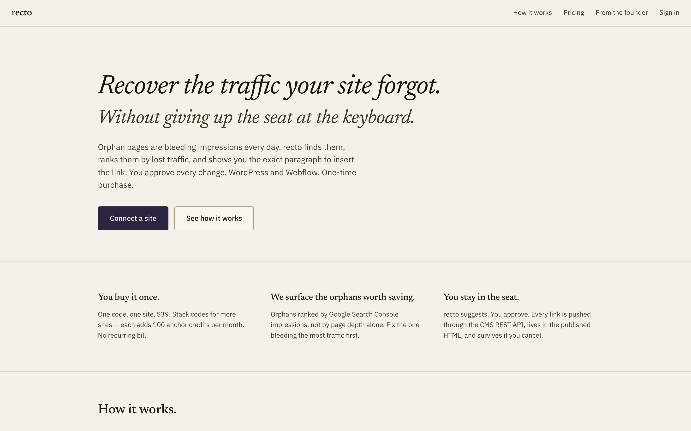
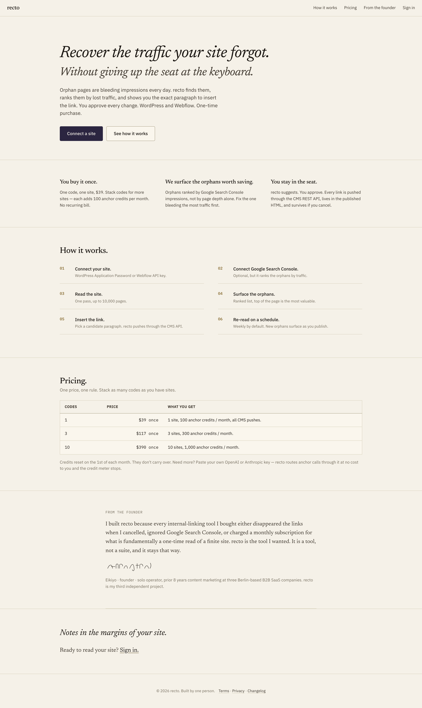
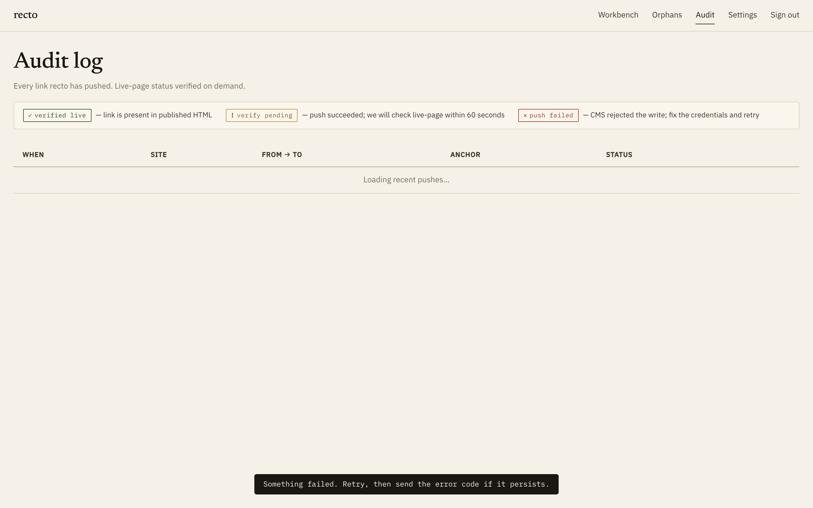

<div align="center">


# recto

**Find the pages your site forgot — and the exact paragraph that should link to them.**

Orphan-page rescue and internal-link insertion for serious WordPress and Webflow sites. Built entirely on the Cloudflare developer platform.

[](https://github.com/eikiyo/recto/actions/workflows/ci.yml)
[](LICENSE)
[](https://workers.cloudflare.com/)
[](CONTRIBUTING.md)

<br>



</div>

---

## What it does

A growing site quietly accumulates **orphan pages** — published URLs that nothing else links to. Search engines struggle to find them, and the traffic they could earn leaks away.

`recto` reads every page you have published, finds the orphans, ranks them by **lost Google Search Console impressions**, and shows you the **exact paragraph** on another page where an internal link belongs. You approve each suggestion; `recto` pushes the link through your CMS's REST API so it lives in the published HTML and survives even if you stop using the tool.

- **You stay in the seat.** recto suggests, you approve. Every change is yours.
- **Ranked by real traffic.** Orphans sorted by GSC impressions, not page depth.
- **Links that persist.** Pushed via the CMS API into published HTML — no shadow DB, no lock-in.
- **Bring your own key.** Paste an OpenAI/Anthropic key and route anchor generation through it.

## How it works

1. **Connect a site** — WordPress Application Password or Webflow API key.
2. **Connect Google Search Console** (optional) — ranks orphans by traffic.
3. **Read the site** — one crawl pass, up to 10,000 pages.
4. **Surface the orphans** — ranked list, most valuable first.
5. **Insert the link** — pick a candidate paragraph; recto pushes it through the CMS API.
6. **Re-read on a schedule** — weekly by default; new orphans surface as you publish.

## Repository layout

This is a monorepo with two top-level packages:

```
.
├── recto/        # The backend — pnpm/Cloudflare monorepo
│   ├── apps/
│   │   ├── workers/api/   # Hono API on Cloudflare Workers
│   │   └── web/           # static Pages bundle (mirror of recto-ui)
│   ├── packages/
│   │   ├── db/            # Drizzle (D1 dialect) schema + migrations
│   │   ├── shared/        # zod schemas, constants, shared types
│   │   └── eslint-recto/  # brand-voice + hook-pattern lint rules
│   ├── load/             # k6 load scripts
│   ├── scripts/          # smoke / integration / fuzz / deploy
│   └── ops/runbooks/     # operational runbooks (e.g. GSC OAuth setup)
└── recto-ui/     # The frontend — audited static UI (landing + app shell)
    ├── app/              # signed-in app screens (vanilla HTML/CSS/JS)
    ├── styles/           # design tokens + components
    └── tests/            # Playwright persona, a11y, and visual-baseline gates
```

## Architecture

Cloudflare-only. No servers, no containers.

| Concern | Cloudflare primitive |
|---|---|
| API | **Workers** (Hono) |
| Relational data (OLTP) | **D1** (SQLite) |
| Embeddings / similarity | **Vectorize** |
| Sessions, rate limits, ETag cache | **KV** |
| Cold blobs (audit archive) | **R2** |
| Async jobs (crawl / embed / push / verify / email) | **Queues** |
| Scheduled work (digests, credit reset) | **Cron Triggers** |
| Embedding + anchor-generation floor | **Workers AI** (BGE, Llama 3.1 8B) |
| JS-rendered pages | **Browser Rendering** |
| Crawl progress (SSE) | **Durable Objects** |
| Transactional email | Emailit → Resend → **MailChannels** fallback |

## Screenshots

The landing page:

[](docs/screenshots/landing-full.png)

The signed-in app — every link is suggested, you approve each one. The audit log
shows the verify-state legend for every CMS push:

[](docs/screenshots/app-audit.png)

<sub>The app screens (`docs/screenshots/app-*.png`) are the **static design shells**
captured without a running backend — empty-state and loading copy is visible
because no API is connected. Run `pnpm setup` to see them populated with live data.</sub>

## Quickstart

> Prerequisites: **Node ≥ 20**, **pnpm 9**, and a free **Cloudflare account**.
> `wrangler` is already a dev dependency — `pnpm install` brings it in, no global install needed.

```bash
git clone https://github.com/eikiyo/recto.git && cd recto/recto && pnpm setup
```

That one line does **everything**: it auto-generates local dev secrets (so the
app boots with **zero key-pasting**), opens `.dev.vars` in case you want to add
real GSC/Emailit keys, installs the whole workspace, creates + migrates the local
D1 database, and launches the **API on http://localhost:8787** and the **UI on
http://localhost:8765** together (Ctrl-C stops both).

> First run, `pnpm install` downloads the toolchain (wrangler, drizzle,
> playwright) — that's a one-time few minutes. After it, boot is seconds. The
> only thing you ever *have* to type is that one command.

<details>
<summary>Prefer to run the steps yourself?</summary>

```bash
pnpm install
cp apps/workers/api/.dev.vars.example apps/workers/api/.dev.vars   # then fill in keys
pnpm --filter @recto/api db:migrate:local   # applies the committed migrations
pnpm dev          # both servers; or pnpm dev:api / pnpm dev:web separately
```

> Note: `db:generate` is a **maintainer-only** step — run it only when you change
> `schema.ts`. The repo ships curated migrations, so a fresh clone just applies
> them with `db:migrate:local`.
</details>

Health check:

```bash
curl http://localhost:8787/api/health
# → {"status":"ok","checks":{"env":"dev","db":"bound","kv":"bound",...,"dbPing":"ok"},"ts":...}
```

To deploy your own instance, create the Cloudflare resources and paste their IDs into `recto/apps/workers/api/wrangler.toml` (search for `REPLACE_WITH_`):

```bash
cd recto
pnpm exec wrangler d1 create recto
pnpm exec wrangler kv namespace create KV
# then set production secrets:
pnpm exec wrangler secret put RECTO_KEK
pnpm exec wrangler secret put MAGIC_LINK_SECRET
# …etc (see apps/workers/api/.dev.vars.example for the full list)
```

## Configuration

All runtime configuration is environment-driven. The single source of truth is
[`recto/apps/workers/api/.dev.vars.example`](recto/apps/workers/api/.dev.vars.example),
which documents every variable the Worker reads and where to obtain it. Non-secret
bindings (D1, KV, Queues, R2, Vectorize, AI) are declared in
[`recto/apps/workers/api/wrangler.toml`](recto/apps/workers/api/wrangler.toml).

The Google Search Console OAuth setup is the one manual step — a full walkthrough lives in
[`recto/ops/runbooks/gsc-setup.md`](recto/ops/runbooks/gsc-setup.md).

## Testing

```bash
cd recto
pnpm --filter @recto/api typecheck   # strict TypeScript
pnpm --filter @recto/api lint        # ESLint + brand-voice rules
pnpm --filter @recto/api test        # vitest: unit, property, chaos
bash scripts/smoke.sh                # API smoke test (needs wrangler dev running)
```

The frontend ships its own audited Playwright suite (persona simulations,
accessibility, and visual-baseline snapshots) under `recto-ui/tests/`.

## Contributing

Issues and pull requests are welcome. Please read [CONTRIBUTING.md](CONTRIBUTING.md)
and the [Code of Conduct](CODE_OF_CONDUCT.md) first. Security reports go through the
process in [SECURITY.md](SECURITY.md).

## License

[MIT](LICENSE) © 2026 Eikiyo
